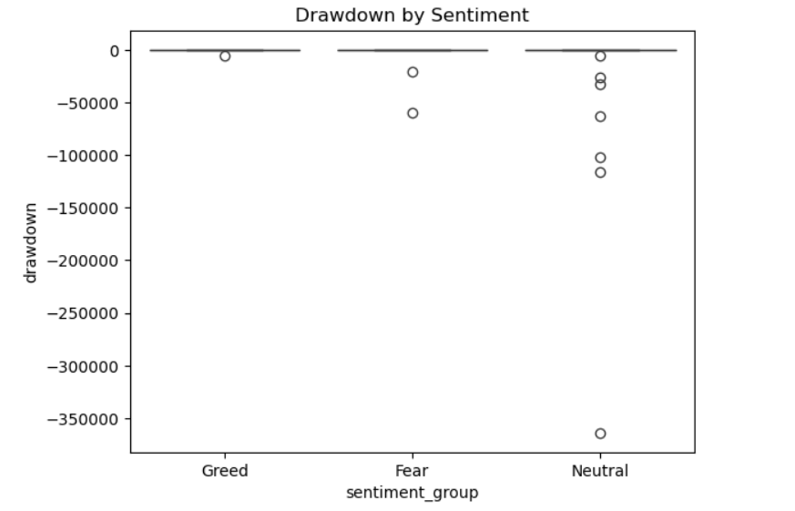
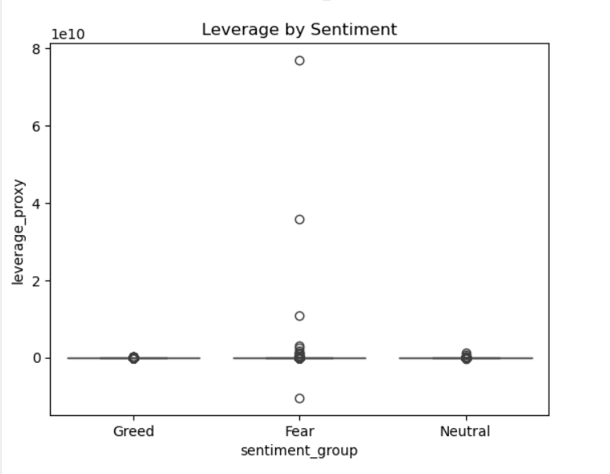

# Trader Behavior vs Market Sentiment Analysis

# Overview

This project investigates the relationship between cryptocurrency market sentiment (Fear & Greed Index) and trader performance and behavior.

The objective is to determine:

* Whether trader profitability changes during Fear vs Greed market conditions.
* Whether traders alter their behavior based on sentiment.
* Which trader segments perform best under different market conditions.
* Whether sentiment and behavioral features can be used to predict profitability.

---

# Setup

## Requirements

Python 3.10+

Install dependencies:

```bash
pip install pandas numpy matplotlib seaborn scipy scikit-learn jupyter
```

Or:

```bash
pip install -r requirements.txt
```

---

# How to Run

## Step 1

Clone the repository:

```bash
git clone https://github.com/<your-username>/Trader-Behavior-vs-Market-Sentiment-Analysis.git
```

## Step 2

Navigate into the project folder:

```bash
cd Trader-Behavior-vs-Market-Sentiment-Analysis
```

## Step 3

Launch Jupyter Notebook:

```bash
jupyter notebook
```

## Step 4

Open:

```text
Trader_Sentiment_Analysis.ipynb
```

## Step 5

Run all notebook cells from top to bottom.

---

# Results

## Performance Comparison


### Average Profitability

| Sentiment | Average PnL |
| --------- | ----------: |
| Fear      |       50.05 |
| Greed     |       87.89 |

Greed periods generated approximately 76% higher profitability than Fear periods.

---

### Win Rate


| Sentiment | Win Rate |
| --------- | -------: |
| Fear      |    41.5% |
| Greed     |    44.6% |

Win rates improved during Greed periods.

### Drawdown


### Trade Frequency


### Position Size


### Leverage


### Sentiment Stats

---

### Statistical Test

| Metric      | Value    |
| ----------- | -------- |
| T-statistic | -4.90    |
| P-value     | 9.42e-07 |

The profitability difference between Fear and Greed periods is statistically significant.

---

### Trader Segmentation

#### High vs Low Aggressiveness

| Segment             | Avg PnL | Win Rate |
| ------------------- | ------: | -------: |
| High Aggressiveness |   27.29 |    40.7% |
| Low Aggressiveness  |   73.65 |    41.6% |

#### Frequent vs Infrequent

| Segment    | Avg PnL | Win Rate |
| ---------- | ------: | -------: |
| Frequent   |   42.49 |    41.5% |
| Infrequent |   96.94 |    37.9% |

#### Consistent Winners vs Inconsistent

| Segment              | Avg PnL | Win Rate |
| -------------------- | ------: | -------: |
| Consistent Winners   |   49.60 |    42.9% |
| Inconsistent Traders |   43.92 |    30.9% |

---


# Predictive Model

## Objective

Predict trade profitability using sentiment and trader behavior features.

## Model

Random Forest Classifier

## Features

* Fear & Greed Value
* Position Aggressiveness Proxy
* Trade Size (USD)

## Results

| Metric    | Value |
| --------- | ----: |
| Accuracy  |   68% |
| Precision |   63% |
| Recall    |   55% |

## Conclusion

The model achieved approximately 68% accuracy, suggesting that market sentiment and trader behavior contain useful predictive information regarding future trade profitability.


---

# Project Report

A detailed one-page report containing methodology, key insights, strategy recommendations, and predictive modeling results is available below:

📄 **Project Report**

[Trader_Behavior_vs_Market_Sentiment_Analysis.pdf](Trader_Behavior_vs_Market_Sentiment_Analysis.pdf)

---
